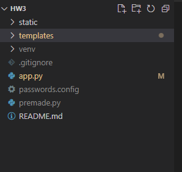
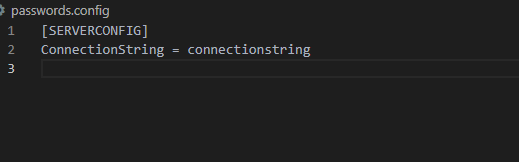

# HW3 #

Hello whoever is grading this! This is how you add your own connection string to the app!

In the root repository create a file called 'passwords.config'

Then, simply format the file like this, replacing 'connectionstring' with your own connection string.

Then the app.py file will parse the config file and use it in the application:

app.config["SQLALCHEMY_DATABASE_URI"] = configParser["SERVERCONFIG"]["ConnectionString"]
